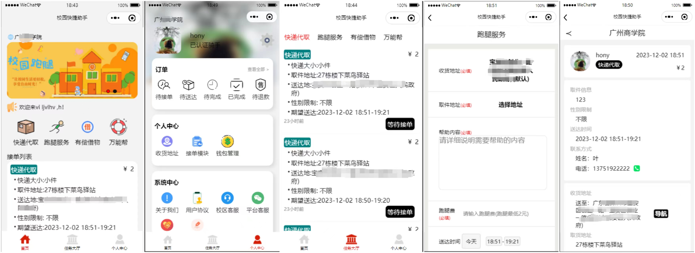
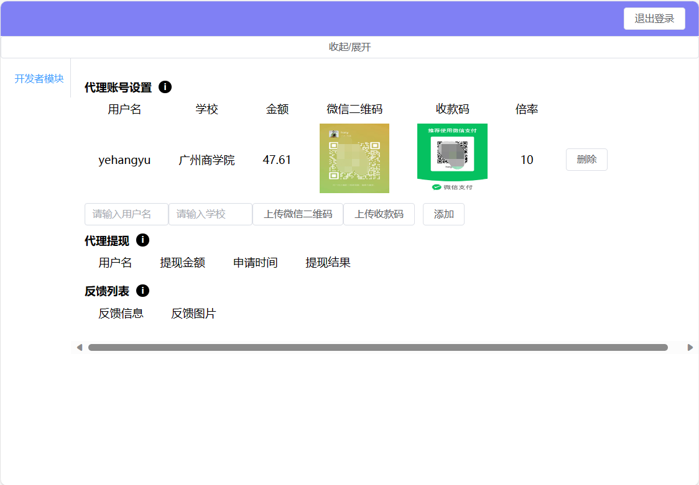
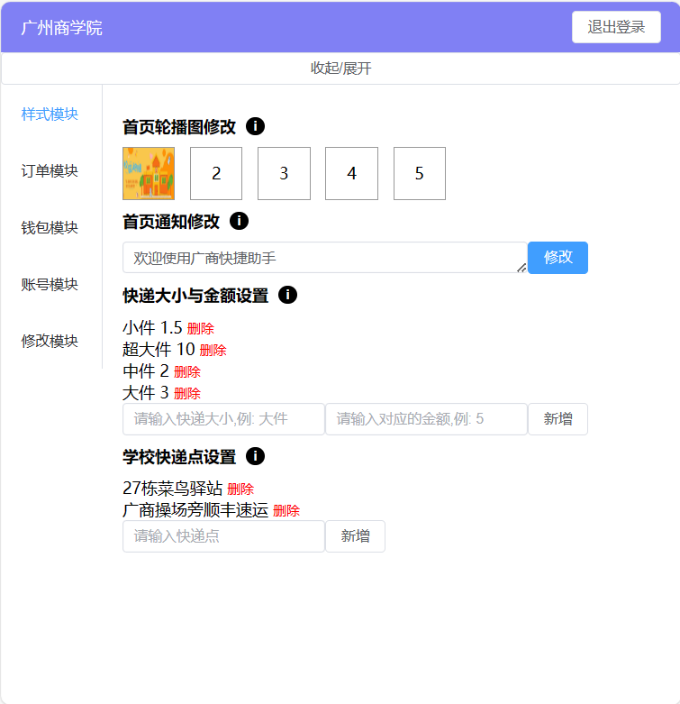
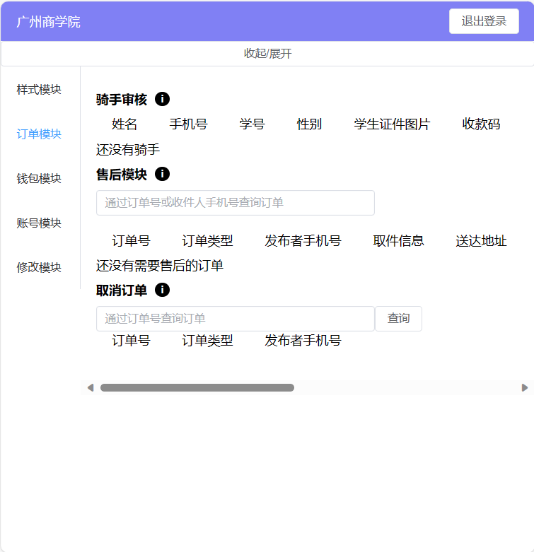
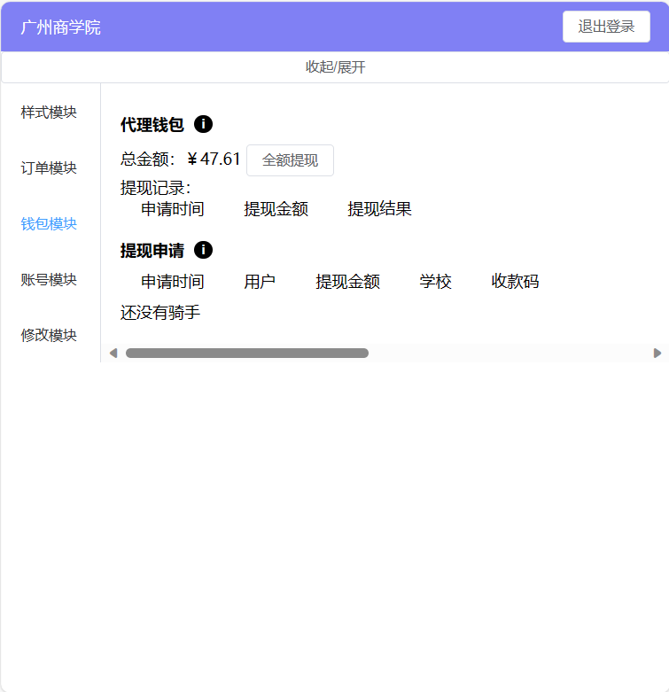
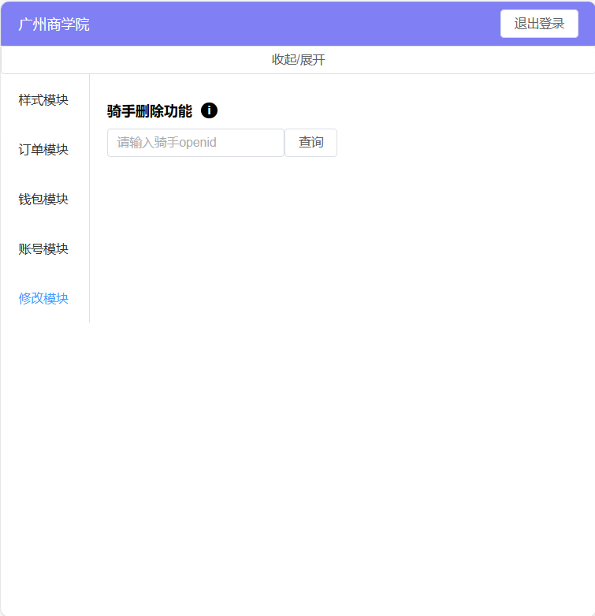

# 跑腿项目介绍

该校园跑腿项目是一个面向学生的服务平台，旨在提供便捷的校园内跑腿服务。

# 主要功能实现
1. 用户功能(前台)： 
- 登录功能：用户可以在个人中心页进行登录，并设置头像、昵称和所在学校。 
- 发布订单：登录后用户可以发布订单，包括快递代取、跑腿服务、有偿借物等，可设置并支付赏金。 
- 申请成为校园跑腿：用户可以上传姓名、手机号、学号、学生证照片和收款码，申请成为校园跑腿以便接 取任务。 
- 订单管理：用户可以取消未被接取的订单，返还支付金额；对于已接取的订单，可以与校园代理联系进行 退款处理。 
2. 校园跑腿功能(前台) 
- 接取任务：校园跑腿在通过审核后可以接取任务，并完成任务要求。 
- 完成任务：校园跑腿完成任务后，发布者可以确认任务或申请退款；代理与校园跑腿和发布者协商处理退 款问题，根据责任归属确定退款金额。
- 赏金分发：确认任务后，赏金将分发给校园跑腿、代理和开发者。
- 钱包管理：校园跑腿可以在钱包中查看自己的赏金余额，并在满足一定金额后进行提现。 
3. 代理功能(后台)
- 样式与费用修改：代理权限可以对所负责校区的小程序端进行样式和费用的修改，如首页轮播图、通知信 息、订单费用等。
- 学校快递点管理：代理可以增加和删除学校的快递点。
- 学校快递点管理：代理可以增加和删除学校的快递点。
- 售后处理：代理负责处理发布者订单的售后问题。
- 钱包管理：代理可以进行自身的钱包金额提现以及处理骑手的提现请求。
- 抽成设置：代理可以设置跑腿完成任务后的赏金抽成。
- 骑手管理：代理可以添加、删除骑手。
4. 开发者功能(后台)
- 代理管理：开发者有添加和删除代理的权限。
- 代理提现处理：开发者负责处理代理的提现请求。
- 用户反馈处理：开发者处理小程序端用户的反馈信息。 

# 使用技术： 
- 小程序前台：采用小程序原生开发，使用微信小程序开发框架。 
- 后台网页：使用Vue3作为前端框架，结合Element Plus进行页面布局和交互设计。
- 后端：采用Express作为后端框架，使用MySQL作为数据库存储技术。

# 要点：
- 用户认证与权限管理：实现用户登录功能，并根据角色分配不同的权限，如代理、校园跑腿和开发者权 限，确保系统安全性和数据管理的准确性。
- 任务发布与接取流程：设计订单发布和接取的流程，包括支付赏金、任务确认、退款处理等环节，保证 订单的顺利完成，并考虑到特殊情况下的处理方式。
- 代理管理与定制化需求：代理权限可以根据不同学校的需求进行相应的定制化修改，灵活满足各个校区 的特殊要求。
- 消息订阅：在跑腿审核后，接取任务后、完成任务后等场景都会给人员发起订阅通知。

## 如何运行项目

- 该项目有小程序端+后台，这里仅发布小程序端代码，如想运行完整代码可添加微信联系开发者：13751923839
- 正常版本需要营业执照才可运行，改了一份简单版本（无真实支付功能），但其他所有功能都正常，可用来当毕设，需要也可联系（有偿，100源码，包运行+20）
- 点点小星星，源码8折优惠

# 测试案例(使用微信扫码打开小程序)

后台网站：http://yhy.yehangyu.icu:9527
账号：try
密码：123456
- 因为使用的是美国服务器，因此访问速度会可能比较慢(没反应可以等待10秒后再点击一下按钮)

# 程序图片展示

